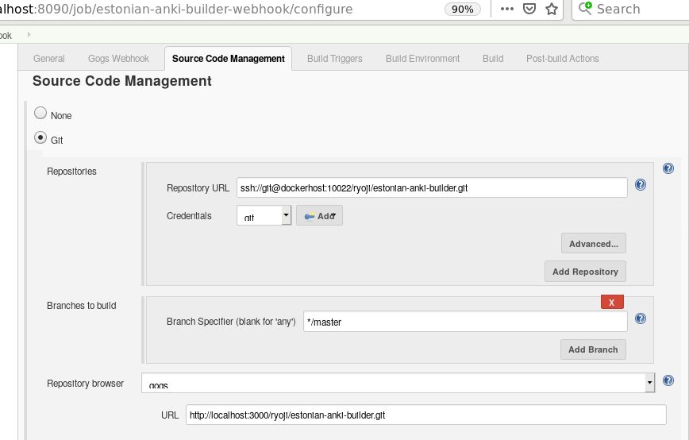

# Example of Docker, Gitea+Jenkins, Selenium

It is important to bind docker services running in localhost with DNS name `dockerhost` by the means of shell and the docker proxy.

## docker user group
```
sudo groupadd docker
sudo gpasswd -a $USER docker
```

## dockerhost
every docker-run.sh contains the following lines for dockerhost which is forwarded to docker-compose.yml. 
```
# https://stackoverflow.com/questions/24319662/from-inside-of-a-docker-container-how-do-i-connect-to-the-localhost-of-the-mach
export DOCKERHOST=$(ifconfig | grep -E "([0-9]{1,3}\.){3}[0-9]{1,3}" | grep -v 127.0.0.1 | awk '{ print $2 }' | cut -f2 -d: | head -n1)
docker-compose -f docker-compose.yml up
```
# setup 1

## ssh

```
ssh-keygen -f gitea -t rsa -b 4096
# name it gitea
```

```
vim ~/.ssh/config
Host gitea
   Hostname localhost
   User git
   Port 10022
   PreferredAuthentications publickey
   IdentityFile ~/.ssh/gitea
```

## jenkins

```
cd jenkins
./docker-run.sh
# note: sh contains `chown 1000 local_jenkins_home`
```

```
version: '3'
services:
  jenkins:
    image: jenkins/jenkins:lts
    volumes:
      - ./local_jenkins_home:/var/jenkins_home
    ports:
      - "8090:8080"
      - "50000:50000"
    restart: always
    extra_hosts:
      - "dockerhost:$DOCKERHOST"
```

open localhost:8090

## gitea

```
cd gitea
./docker-run.sh
```
open localhost:3000

```
version: '3'
services:
  web:
    image: gitea/gitea:1.8
    volumes:
      - ./local-gitea-data:/data
    ports:
      - "3000:3000"
      - "10022:22"
    environment:
      - TZ=Japan
      - SSH_PORT=10022
    restart: always
    extra_hosts:
      - "dockerhost:$DOCKERHOST"
```

# setup 2

## gitea


## jenkins



https://plugins.jenkins.io/gogs-webhook


# webhook
# selenium
