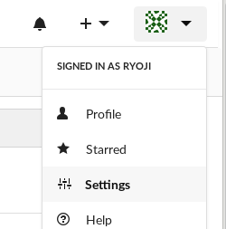
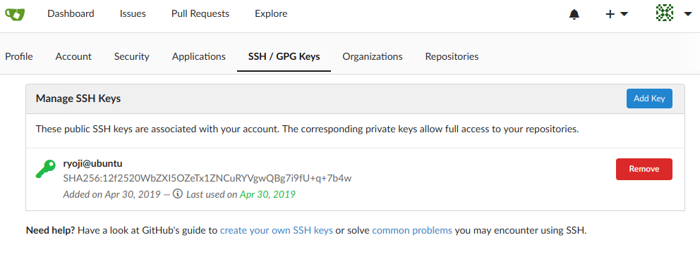
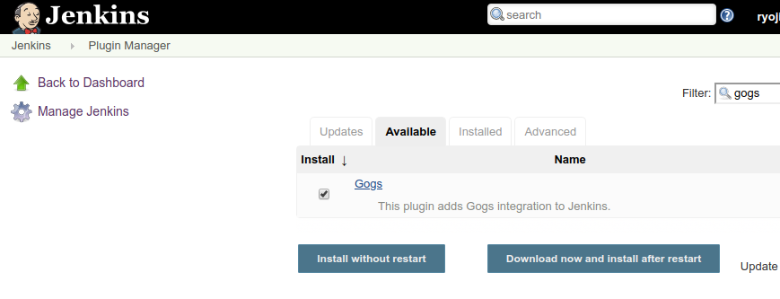
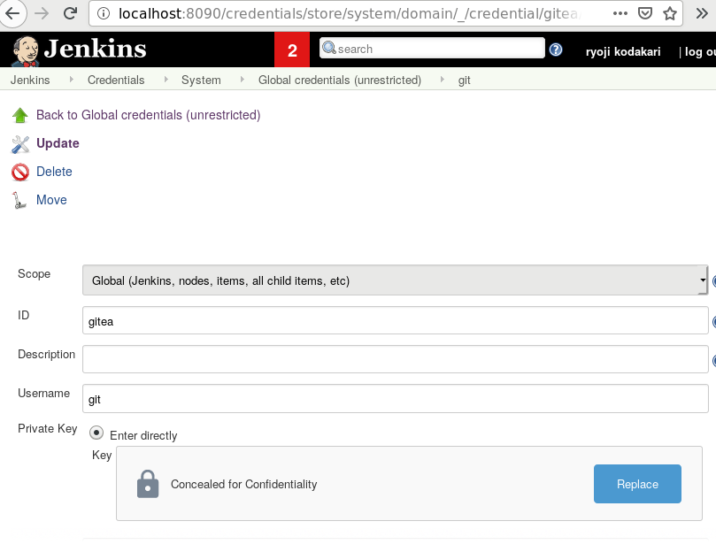
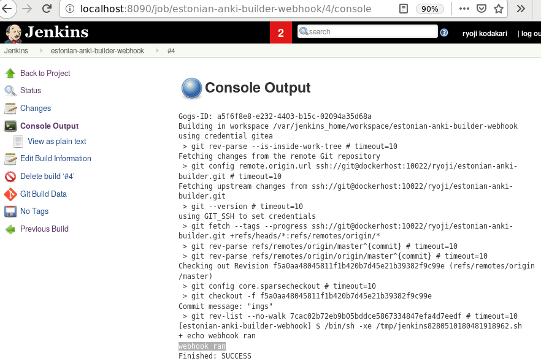
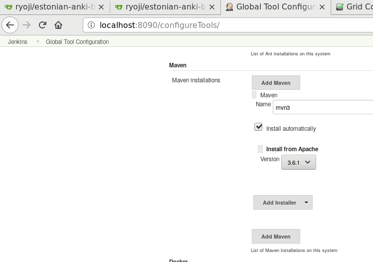
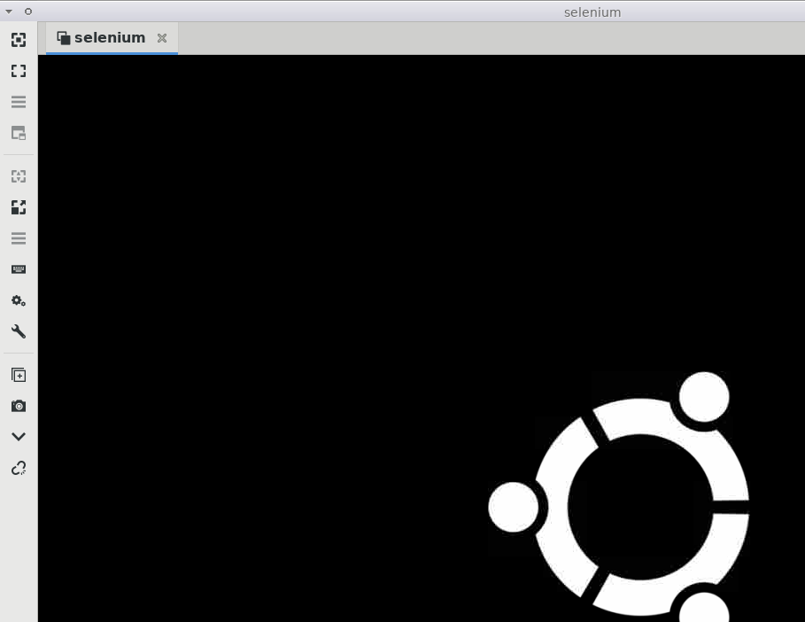
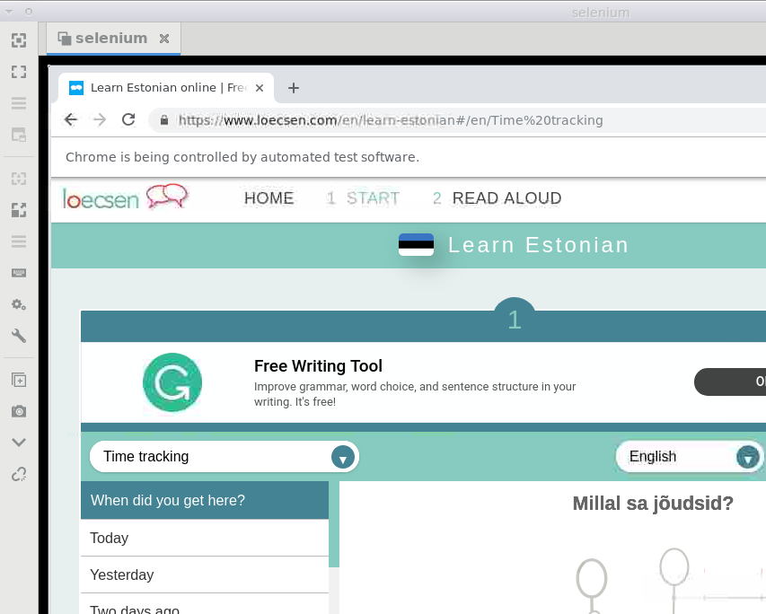
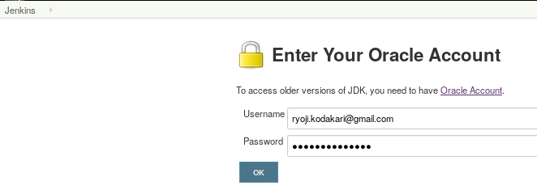

# Example of Docker, Gitea+Jenkins - webhook & pipeline, Selenium


It is important to bind docker services running in localhost with DNS name `dockerhost` by the means of shell and the docker proxy.

## docker user group
```
sudo groupadd docker
sudo gpasswd -a $USER docker
```

## dockerhost
every docker-run.sh contains the following lines for dockerhost which is forwarded to docker-compose.yml. 
```
# https://stackoverflow.com/questions/24319662/from-inside-of-a-docker-container-how-do-i-connect-to-the-localhost-of-the-mach
export DOCKERHOST=$(ifconfig | grep -E "([0-9]{1,3}\.){3}[0-9]{1,3}" | grep -v 127.0.0.1 | awk '{ print $2 }' | cut -f2 -d: | head -n1)
docker-compose -f docker-compose.yml up
```
# setup 1

## ssh

```
ssh-keygen -f gitea -t rsa -b 4096
# name it gitea
```

```
vim ~/.ssh/config
Host gitea
   Hostname localhost
   User git
   Port 10022
   PreferredAuthentications publickey
   IdentityFile ~/.ssh/gitea
```

## jenkins

```
cd jenkins
./docker-run.sh
# note: sh contains `chown 1000 local_jenkins_home`
```

```
version: '3'
services:
  jenkins:
    image: jenkins/jenkins:lts
    volumes:
      - ./local_jenkins_home:/var/jenkins_home
    ports:
      - "8090:8080"
      - "50000:50000"
    restart: always
    extra_hosts:
      - "dockerhost:$DOCKERHOST"
```

open localhost:8090

## gitea

```
cd gitea
./docker-run.sh
```
open localhost:3000

```
version: '3'
services:
  web:
    image: gitea/gitea:1.8
    volumes:
      - ./local-gitea-data:/data
    ports:
      - "3000:3000"
      - "10022:22"
    environment:
      - TZ=Japan
      - SSH_PORT=10022
    restart: always
    extra_hosts:
      - "dockerhost:$DOCKERHOST"
```

## selenium


```
cd selenium
./docker-run.sh
```

open localhost:4444

```
version: "3.3"

services:
  selenium-hub:
    image: selenium/hub:3.141.0
    ports:
      - "4444:4444"
    networks: [selenium-grid]
    environment:
      - GRID_BROWSER_TIMEOUT=3400
      - GRID_TIMEOUT=3600
    restart: always
    extra_hosts:
      - "dockerhost:$DOCKERHOST"
  chrome-node:
    image: selenium/node-chrome-debug:3.141.0
    ports:
      - "5900:5900"
    environment:
      HUB_PORT_4444_TCP_ADDR: selenium-hub
      HUB_PORT_4444_TCP_PORT: 4444
    volumes:
      - ./hub:/dev/random
    networks: [selenium-grid]
    links:
      - selenium-hub:selenium-hub
    depends_on:
      - selenium-hub


networks:
  selenium-grid:
    driver: bridge
    external: false
```

# setup 2

## gitea





## jenkins

### install gog plugin
https://plugins.jenkins.io/gogs-webhook



### git ssh credentials

Jenkins > Credentials > System



### git host
 * use `dockerhost` as the DNS name.
 * Credentials:`git`


### attach webhook

Settings > Webhooks > Add Webhooks > Gitea


### build (shell)

for example,




### build (maven)

for example,

Jenkins > Global Tool Configuration > Maven




## selenium


```
sudo snap install remmina
snap run remmina
localhost:5900 (VNC)
User password: secret
```

Eclipse > run EestiLoecsenSelenium.java

In dockered Jenkins, this address must be `dockerhost` instead of `127.0.0.1`




# setup 3 (pipeline)

## Gitea webhook

```
http://dockerhost:8090/gogs-webhook/?job=eesti-anki-pipeline
```

## Jenkins

Jenkins > Global Tool Configuration > JDK


http://localhost:8090/descriptorByName/hudson.tools.JDKInstaller/enterCredential




### Jenkinsfile
https://jenkins.io/blog/2017/02/07/declarative-maven-project/

```
pipeline {
    agent any
    tools {
        maven 'mvn3'
        jdk 'jdk8'
    }
    stages {
        stage ('Initialize') {
            steps {
                sh '''
                    echo "PATH = ${PATH}"
                    echo "M2_HOME = ${M2_HOME}"
                '''
            }
        }

        stage ('Build') {
            steps {
                sh 'mvn -Dmaven.test.failure.ignore=true test' 
            }
            post {
                success {
                    junit 'target/surefire-reports/**/*.xml' 
                }
            }
        }
    }
}
```

### Selenium


```
package com.github.growingspaghetti.eesti;

import java.net.URL;
import java.util.ArrayList;
import java.util.List;
import java.util.Optional;
import java.util.stream.Collectors;
import org.hamcrest.core.StringContains;
import org.junit.Assert;
import org.junit.Test;
import org.openqa.selenium.By;
import org.openqa.selenium.JavascriptExecutor;
import org.openqa.selenium.WebDriver;
import org.openqa.selenium.WebElement;
import org.openqa.selenium.remote.DesiredCapabilities;
import org.openqa.selenium.remote.RemoteWebDriver;
import org.openqa.selenium.support.ui.ExpectedConditions;
import org.openqa.selenium.support.ui.WebDriverWait;

public class EestiLoecsenSeleniumTest {
    @Test
    public void testSelenium() throws Exception {
        WebDriver driver = new RemoteWebDriver(
            new URL("http://dockerhost:4444/wd/hub"),
            DesiredCapabilities.chrome());

        List<String> pages = new ArrayList<String>();
        try {
            driver.get("https://www.loecsen.com/en/learn-estonian");
            WebElement   itemdiv = driver.findElement(By.id("list_t"));
            List<String> targets
                = itemdiv
                      .findElements(By.xpath("//div[@id='list_t']//li"))
                      .stream()
                      .map(WebElement::getText)
                      .map(String::trim)
                      .collect(Collectors.toList());

            for (String target : targets) {
                System.out.println("page: " + target);
                By         by = By.xpath("//div[@id='list_t']//li//h3[contains(text(), '" + target + "')]");
                WebElement we = itemdiv.findElement(by);
                // https://stackoverflow.com/questions/37879010/selenium-debugging-element-is-not-clickable-at-point-x-y
                // we.click();
                ((JavascriptExecutor)driver).executeScript("arguments[0].click();", we);

                WebDriverWait wait       = new WebDriverWait(driver, 10);
                WebElement    playButton = driver.findElement(By.id("btn_autoplay"));
                wait.until(ExpectedConditions.elementToBeClickable(playButton));

                WebElement js   = driver.findElement(By.xpath("//div[@id='container']//script"));
                String     code = (String)((JavascriptExecutor)driver)
                                  .executeScript("return jQuery(arguments[0]).text();", js);

                System.out.println(code);
                Assert.assertThat(code, StringContains.containsString("https://www.loecsen.com/OrizonFlash_V2"));
                pages.add(code);
            }
        } finally {
            Optional.ofNullable(driver).ifPresent(WebDriver::quit); // not close
        }
    }
}

```

```
Started
Obtained Jenkinsfile from git ssh://git@dockerhost:10022/ryoji/estonian-anki-builder.git
Running in Durability level: MAX_SURVIVABILITY
[Pipeline] Start of Pipeline
[Pipeline] node
Running on Jenkins in /var/jenkins_home/workspace/eesti-anki-pipeline
[Pipeline] {
[Pipeline] stage
[Pipeline] { (Declarative: Checkout SCM)
[Pipeline] checkout
using credential gitea
 > git rev-parse --is-inside-work-tree # timeout=10
Fetching changes from the remote Git repository
 > git config remote.origin.url ssh://git@dockerhost:10022/ryoji/estonian-anki-builder.git # timeout=10
Fetching upstream changes from ssh://git@dockerhost:10022/ryoji/estonian-anki-builder.git
 > git --version # timeout=10
using GIT_SSH to set credentials 
 > git fetch --tags --progress ssh://git@dockerhost:10022/ryoji/estonian-anki-builder.git +refs/heads/*:refs/remotes/origin/*
 > git rev-parse refs/remotes/origin/master^{commit} # timeout=10
 > git rev-parse refs/remotes/origin/origin/master^{commit} # timeout=10
Checking out Revision 1bf410461ee37d5982a68a338b7f0af13ad86718 (refs/remotes/origin/master)
 > git config core.sparsecheckout # timeout=10
 > git checkout -f 1bf410461ee37d5982a68a338b7f0af13ad86718
Commit message: "CI setup.md > README.md"
 > git rev-list --no-walk 738f805ea54a7f0d37b12721d9e99e1776e8cb81 # timeout=10
[Pipeline] }
[Pipeline] // stage
[Pipeline] withEnv
[Pipeline] {
[Pipeline] stage
[Pipeline] { (Declarative: Tool Install)
[Pipeline] tool
[Pipeline] envVarsForTool
[Pipeline] tool
[Pipeline] envVarsForTool
[Pipeline] }
[Pipeline] // stage
[Pipeline] withEnv
[Pipeline] {
[Pipeline] stage
[Pipeline] { (Initialize)
[Pipeline] tool
[Pipeline] envVarsForTool
[Pipeline] tool
[Pipeline] envVarsForTool
[Pipeline] withEnv
[Pipeline] {
[Pipeline] sh
+ echo PATH = /var/jenkins_home/tools/hudson.model.JDK/jdk8/bin:/var/jenkins_home/tools/hudson.tasks.Maven_MavenInstallation/mvn3/bin:/var/jenkins_home/tools/hudson.model.JDK/jdk8/bin:/var/jenkins_home/tools/hudson.tasks.Maven_MavenInstallation/mvn3/bin:/usr/local/sbin:/usr/local/bin:/usr/sbin:/usr/bin:/sbin:/bin
PATH = /var/jenkins_home/tools/hudson.model.JDK/jdk8/bin:/var/jenkins_home/tools/hudson.tasks.Maven_MavenInstallation/mvn3/bin:/var/jenkins_home/tools/hudson.model.JDK/jdk8/bin:/var/jenkins_home/tools/hudson.tasks.Maven_MavenInstallation/mvn3/bin:/usr/local/sbin:/usr/local/bin:/usr/sbin:/usr/bin:/sbin:/bin
+ echo M2_HOME = /var/jenkins_home/tools/hudson.tasks.Maven_MavenInstallation/mvn3
M2_HOME = /var/jenkins_home/tools/hudson.tasks.Maven_MavenInstallation/mvn3
[Pipeline] }
[Pipeline] // withEnv
[Pipeline] }
[Pipeline] // stage
[Pipeline] stage
[Pipeline] { (Build)
[Pipeline] tool
[Pipeline] envVarsForTool
[Pipeline] tool
[Pipeline] envVarsForTool
[Pipeline] withEnv
[Pipeline] {
[Pipeline] sh
+ mvn -Dmaven.test.failure.ignore=true test
[INFO] Scanning for projects...
[INFO] 
[INFO] -----------------------< growingspaghetti:eesti >-----------------------
[INFO] Building eesti 0.0.1-SNAPSHOT
[INFO] --------------------------------[ jar ]---------------------------------
[INFO] 
[INFO] --- maven-resources-plugin:2.6:resources (default-resources) @ eesti ---
[INFO] Using 'UTF-8' encoding to copy filtered resources.
[INFO] skip non existing resourceDirectory /var/jenkins_home/workspace/eesti-anki-pipeline/src/main/resources
[INFO] 
[INFO] --- maven-compiler-plugin:3.1:compile (default-compile) @ eesti ---
[INFO] Nothing to compile - all classes are up to date
[INFO] 
[INFO] --- maven-resources-plugin:2.6:testResources (default-testResources) @ eesti ---
[INFO] Using 'UTF-8' encoding to copy filtered resources.
[INFO] skip non existing resourceDirectory /var/jenkins_home/workspace/eesti-anki-pipeline/src/test/resources
[INFO] 
[INFO] --- maven-compiler-plugin:3.1:testCompile (default-testCompile) @ eesti ---
[INFO] Changes detected - recompiling the module!
[INFO] Compiling 3 source files to /var/jenkins_home/workspace/eesti-anki-pipeline/target/test-classes
[INFO] 
[INFO] --- maven-surefire-plugin:2.12.4:test (default-test) @ eesti ---
[INFO] Surefire report directory: /var/jenkins_home/workspace/eesti-anki-pipeline/target/surefire-reports

-------------------------------------------------------
 T E S T S
-------------------------------------------------------
Running com.github.growingspaghetti.eesti.EestiLoecsenSeleniumTest
page: Essentials

var js_titles ={"88":"essentials","85":"conversation","82":"learning","86":"colours","91":"numbers","93":"time tracking","97":"taxi","96":"feelings","89":"family","83":"bar","94":"restaurant","95":"parting","98":"transportation","84":"looking for someone","90":"hotel","92":"beach","87":"in case of trouble"};
var theme_id =88;
var s_name ='et-ET';
var s_name2 ='en-GB';
var exp_data = {};
exp_data[" 6594"] = {};
exp_data[" 6594"]["img"] = "/OrizonFlash_V2/ressources/svg/LABLANG_V2_1_1.svg";
exp_data[" 6594"]["exp"] = "Tere p&#228;evast!";
exp_data[" 6594"]["var"] = "N";
exp_data[" 6594"]["phon"] = "";
exp_data[" 6594"]["quizz_disabled"] = "";
exp_data[" 6594"]["sound"] = "https://www.loecsen.com/OrizonFlash_V2/ressources/son/anglais-1-1.mp3";
exp_data[" 6594"]["exptra"] = "Hello";
exp_data[" 6594"]["phontra"] = "";
exp_data[" 6594"]["soundtra"] = "https://www.loecsen.com/OrizonFlash_V2/ressources/son/estonien-1-1.mp3";
exp_data[" 8505"] = {};
exp_data[" 8505"]["img"] = "/OrizonFlash_V2/ressources/svg/LABLANG_V2_1_1V.svg";
exp_data[" 8505"]["exp"] = "Tere";
exp_data[" 8505"]["var"] = "Y";
exp_data[" 8505"]["phon"] = "";
exp_data[" 8505"]["quizz_disabled"] = "";
exp_data[" 8505"]["sound"] = "https://www.loecsen.com/OrizonFlash_V2/ressources/son/anglais-1-1.mp3";
exp_data[" 8505"]["exptra"] = "Hello";
exp_data[" 8505"]["phontra"] = "";
exp_data[" 8505"]["soundtra"] = "https://www.loecsen.com/OrizonFlash_V2/ressources/son/estonien-1-1V.mp3";
exp_data[" 6595"] = {};
exp_data[" 6595"]["img"] = "/OrizonFlash_V2/ressources/svg/LABLANG_V2_1_2.svg";
exp_data[" 6595"]["exp"] = "Tere &#245;htust!";
exp_data[" 6595"]["var"] = "N";
exp_data[" 6595"]["phon"] = "";
exp_data[" 6595"]["quizz_disabled"] = "";

Tests run: 1, Failures: 0, Errors: 0, Skipped: 0, Time elapsed: 17.073 sec
Running com.github.growingspaghetti.eesti.AppTest
    @Test
    public void testFoo() throws Exception {
        System.out.println("mvn test");
    }
Tests run: 1, Failures: 0, Errors: 0, Skipped: 0, Time elapsed: 0 sec

Results :

Tests run: 2, Failures: 0, Errors: 0, Skipped: 0

[INFO] ------------------------------------------------------------------------
[INFO] BUILD SUCCESS
[INFO] ------------------------------------------------------------------------
[INFO] Total time:  20.354 s
[INFO] Finished at: 2019-06-26T10:41:47Z
[INFO] ------------------------------------------------------------------------
Post stage
[Pipeline] junit
Recording test results
[Pipeline] }
[Pipeline] // withEnv
[Pipeline] }
[Pipeline] // stage
[Pipeline] }
[Pipeline] // withEnv
[Pipeline] }
[Pipeline] // withEnv
[Pipeline] }
[Pipeline] // node
[Pipeline] End of Pipeline
Finished: SUCCESS
```

